<h1 align=center>한글 조합형 출력 (그리고 편집기)</h1>
<h3 align=center>

조합형으로 렌더링해서 이론적으로 ***'똚밝걁햙'*** 같이 바보같은 글자마저도 출력 가능합니다.

</h3>
<span align=center>

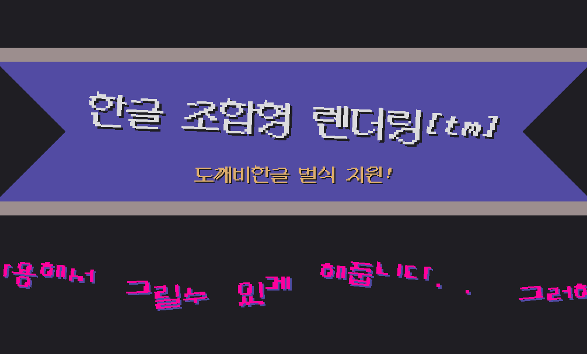

</span>

**목차...**
===
- [프로젝트 파일 관련](https://github.com/TandyRum1024/hangul-johab-render-gms#%ED%94%84%EB%A1%9C%EC%A0%9D%ED%8A%B8-%ED%8C%8C%EC%9D%BC-%EA%B4%80%EB%A0%A8)
- [만든 이유](https://github.com/TandyRum1024/hangul-johab-render-gms#%EC%99%9C-%EB%A7%8C%EB%93%A4%EC%97%88%EB%8A%94%EC%A7%80-%EA%B6%81%EA%B8%88%ED%95%A9%EB%8B%88%EB%8B%A4-aka-%ED%95%9C%EA%B8%80-%EC%B6%9C%EB%A0%A5-%EA%B4%80%EB%A0%A8-%EB%95%A1%EA%B9%A1)
- [기능과 한계점](https://github.com/TandyRum1024/hangul-johab-render-gms#%EA%B8%B0%EB%8A%A5--%ED%95%9C%EA%B3%84%EC%A0%90)
- [정보](https://github.com/TandyRum1024/hangul-johab-render-gms#%EC%95%8C%EC%95%84%EB%91%90%EC%96%B4%EC%95%BC-%ED%95%A0-%EA%B2%83)
    - [함수 길잡이 : 도깨비한글 출력](https://github.com/TandyRum1024/hangul-johab-render-gms#%ED%95%A8%EC%88%98-%EA%B8%B8%EC%9E%A1%EC%9D%B4--%EB%8F%84%EA%B9%A8%EB%B9%84%ED%95%9C%EA%B8%80-%EB%B2%8C%EC%8B%9D--%EA%B8%B0%EB%B3%B8-%EB%B2%8C%EC%8B%9D-%EC%B6%9C%EB%A0%A5-%EA%B4%80%EB%A0%A8)
    - [함수 길잡이 : 사제/이전버전 형식 출력](https://github.com/TandyRum1024/hangul-johab-render-gms#%ED%95%A8%EC%88%98-%EA%B8%B8%EC%9E%A1%EC%9D%B4--%EC%82%AC%EC%A0%9C-%EB%B2%8C%EC%8B%9D--%EC%9D%B4%EC%A0%84-%EB%B2%84%EC%A0%84-%EB%B2%8C%EC%8B%9D-%EC%B6%9C%EB%A0%A5-%EA%B4%80%EB%A0%A8)
    - [함수 길잡이 : 기타](https://github.com/TandyRum1024/hangul-johab-render-gms#%ED%95%A8%EC%88%98-%EA%B8%B8%EC%9E%A1%EC%9D%B4--%EA%B8%B0%ED%83%80)
- [글꼴 관련](https://github.com/TandyRum1024/hangul-johab-render-gms#%EA%B8%80%EA%BC%B4-%EA%B4%80%EB%A0%A8)
    - [글꼴 제작 관련](https://github.com/TandyRum1024/hangul-johab-render-gms#%EA%B8%80%EA%BC%B4-%EC%A0%9C%EC%9E%91-%EA%B4%80%EB%A0%A8)
    - [글꼴 편집기](https://github.com/TandyRum1024/hangul-johab-render-gms#%EA%B8%80%EA%BC%B4-%ED%8E%B8%EC%A7%91%EA%B8%B0)
- [참고 문헌](https://github.com/TandyRum1024/hangul-johab-render-gms#%EC%B0%B8%EA%B3%A0-%EB%AC%B8%ED%97%8C--%EB%8D%94-%EB%B3%B4%EA%B8%B0)

프로젝트 파일 관련
===

`hj_johab.gmez` 는 함수와 여러가지가 담긴 익스텐션 파일입니다.. 게임메이커 내에서 익스텐션을 불러오신 뒤 쓰시면 됩니다. 잘 쓰세요!

`fonts` 폴더는 미리 제작된 글꼴들을 모아둔 폴더입니다.

`조합_글꼴_편집기.exe` 는 글꼴을 제작할때 도움 되는 편집기입니다.

`project\Hangul_boy.gmx` 폴더는 예제 (맨 위의 움짤 포함)의 소스가 담긴 게임메이커 1 프로젝트 폴더입니다.

`project\JohabMaker.gmx` 폴더는 [글꼴 편집기](https://zikbakguru.itch.io/einstein-bacon-machine)의 소스가 담긴 게임메이커 1 프로젝트 폴더입니다.
`template` 폴더는 글꼴 제작에 도움 되는 템플릿을 모아둔 폴더입니다.


왜 만들었는지 궁금합니다?? <i style="font-size: 0.5em">(aka 한글 출력 관련 땡깡)</i>
===
게임메이커와 여느 엔진 특성상, 글자를 그릴 때 따로 텍스쳐에 하나씩 구워둔 글자들을 떼서 뿌리는 방식으로
글자를 출력하는데요,

그런데 말입니다.. 영어같은 경우는 글자가 26개 뿐이니 텍스쳐 걱정을 하지 않아도 되는데,<br>
한국어는 적어도 ***2350*** 자가 필요합니다. 거진 9배가 넘는 양이죠. 게다가 이 2350자는 많이 사용되는 글자들중 엄선된 글자만 포함 된 것입니다.<br>
'뭨' '뵑' 같은 생소한 글자를 포함하면 현대 한글 11172자를 모두 텍스쳐에 구겨넣어야 할 판입니다 :<<br>

하지만 다행이도, 우리 한글은 레고마냥 초성과 중성 그리고 종성을 합쳐서 만들수 있기때문에 (EX : ㄱ + ㅏ + ㄺ => '갉')<br>
이를 이용하면 최대 448자만 가지고도 위에서 말한 글자까지 출력할 수 있게됩니다.

마침 인터넷에 관련 글과 자료가 풍부해서, 한번 만들어보자는 심정으로 제작에 몰두하게 되었습니다.<br>
왜냐고요? 재미있으니깐요™.

기능 & 한계점
===
- 도깨비한글 8x4x4벌식 형태의 스프라이트 글꼴를 사용해 한글 출력
- 글자를 회전시키거나 크기를 줄이거나 늘이는 등 변형 가능합니다
- 글자 줄 당 너비에 제한을 둘 수 있읍니다

하지만 중요한건 퍼포먼스가 썩 좋지 않습니다;; 여러 괴상한 짓거리를 동원해 봤지만,<br>
한글 1글자당 스프라이트를 3개나 그리는탓인지 FPS가 제가 원하는만큼 나오지 않네요.

알아두어야 할 것
===

이 예제는 2가지 방식으로 한글을 출력 할 수 있읍니다:
- 사제 벌식 (비교적 적은 이미지 사용, 부자연스러운 글자, 자모 전용 이미지 사용)
- 도깨비한글 8x4x4벌식 (비교적 자연스러운 글자, 많은 이미지 사용, 자모가 부자연스러움)

*(좌측 : 사제 벌식/이전 버전 벌식, 우측 : 도깨비한글 벌식)*

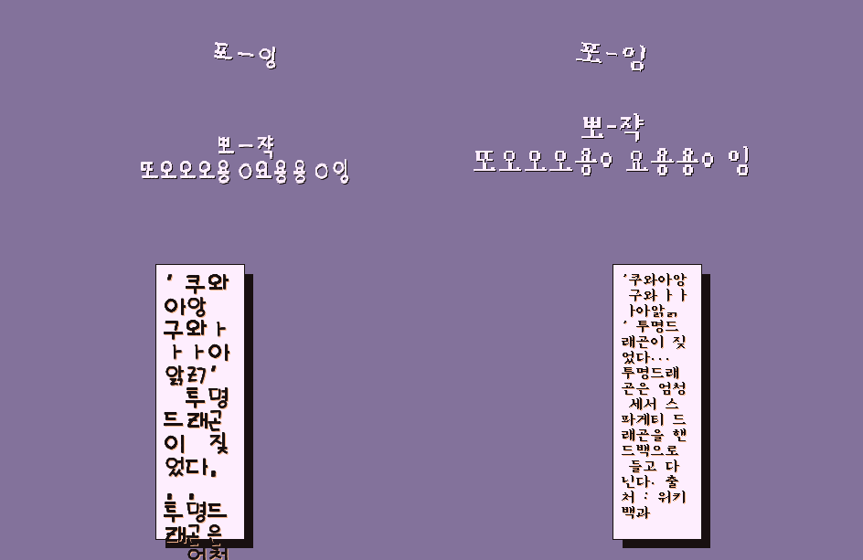

그리고 저번에 공개했던 버전과는 달리 또한 글꼴 스프라이트의 서브이미지를 사용해서 출력합니다.
통채로 되있는 스프라이트를 사용하시려면 `hj_draw_sheet()` 와 `hj_draw_comp_sheet()` 를 사용해 주세요!

**(1번째 : 서브이미지로 나뉜 글꼴의 예, 2번째 : 통짜 글꼴의 예)**
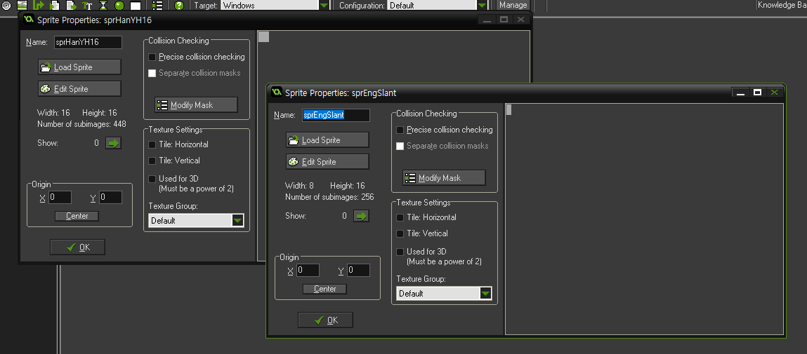
을 사용해 주세요")

다음은 함수에 관한 사용법입니다.<br>
**(컨트롤 오브젝트에서 `hj_init()` 으로 시스템을 초기화 시키신 다음 사용하셔야 합니다!)**

## **함수 길잡이 : 도깨비한글 벌식 / 기본 벌식 출력 관련**
---
| 함수 이름 | 파라미터 (순서대로) | 비고 |
|-----|-----|-----|
|`hj_draw(x, y, str, colour, alpha)`|*X, Y, 출력할 문자열, 색깔, 알파(투명도)*|한글 문자열을 컴파일한 뒤 출력합니다.|
|`hj_draw_ext(x, y, str, sep, width, colour, alpha)`|*X, Y, 문자열, 줄 간격, 너비 제한, 색깔, 알파*|줄 간격 & 줄당 너비에 제한을 둘 수 있읍니다.<br>(줄 간격에 `-1`을 넘기면 알아서 계산합니다.)|
|`hj_draw_transformed(x, y, str, xscale, yscale, angle, colour, alpha)`|*X, Y, 문자열, X 크기, Y 크기, 각도, 색깔, 알파*|문자열을 각도와 크기를 변형시켜 출력합니다.|
|`hj_draw_raw(x, y, str, colour, alpha)`|*X, Y, 문자열, 색깔, 알파*|문자열을 컴파일 시키지 않고 그대로 출력합니다.<br>(매우 느려질 수 있습니다..)|
|`hj_draw_sheet(hansprite, asciisprite, x, y, str, colour, alpha)`|*한글 글꼴, ASCII 글꼴, X, Y, 문자열, 색깔, 알파*|서브이미지 없는 통채로 된 스프라이트를 받아서 출력합니다.<br>(ASCII 글꼴에 `-1`을 넘기면 대신 한글 스프라이트에서 ASCII 문자 구간을 사용합니다.)|

```
hj_draw(x, y, str, colour, alpha)
```
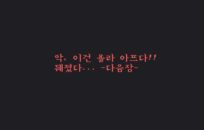
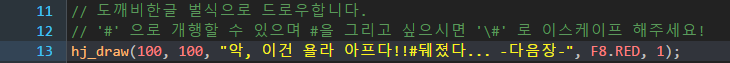

```
hj_draw_ext(x, y, str, sep, width, colour, alpha)
```
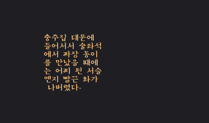
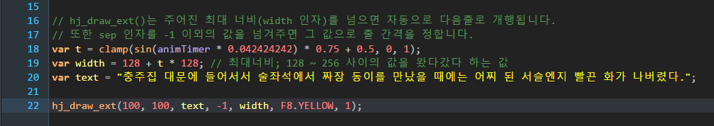

```
hj_draw_transformed(x, y, str, xscale, yscale, angle, colour, alpha)
```
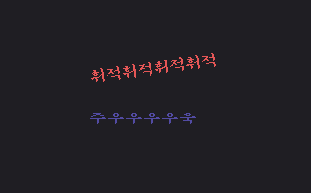
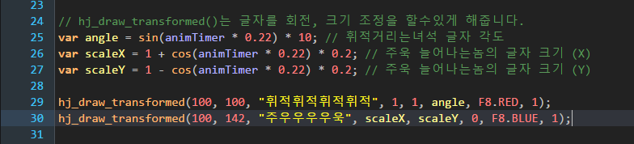

## **함수 길잡이 : 사제 벌식 / 이전 버전 벌식 출력 관련**
---

**(사제 벌식은 모든 출력 함수가 한글 글꼴과 ASCII 글꼴을 받습니다.)**

| 함수 이름 | 파라미터 (순서대로) | 비고 |
|-----|-----|-----|
|`hj_draw_comp(kor_font_sprite, ascii_font_sprite, x, y, str, colour, alpha)`|*한글 글꼴, ASCII 글꼴, X, Y, 문자열, 색깔, 알파*|한글 문자열을 컴파일한 뒤 출력합니다.|
|`hj_draw_comp_ext(kor_font_sprite, ascii_font_sprite, x, y, str, sep, width, colour, alpha)`|*한글 글꼴, ASCII 글꼴, X, Y, 문자열, 줄 간격, 너비 제한, 색깔, 알파*|줄 간격 & 줄당 너비에 제한을 둘 수 있습니다.<br>(줄 간격에 `-1`을 넘기면 알아서 계산합니다.)|
|`hj_draw_comp_transformed(kor_font_sprite, ascii_font_sprite, x, y, str, xscale, yscale, angle, colour, alpha)`|*한글 글꼴, ASCII 글꼴, X, Y, 문자열, X 크기, Y 크기, 각도, 색깔, 알파*|문자열을 각도와 크기를 변형시켜 출력합니다.|
|`hj_draw_comp_raw(kor_font_sprite, ascii_font_sprite, x, y, str, colour, alpha)`|*한글 글꼴, ASCII 글꼴, X, Y, 문자열, 색깔, 알파*|문자열을 컴파일 시키지 않고 그대로 출력합니다.<br>(매우 느려질 수 있습니다..)|
|`hj_draw_comp_sheet(kor_font_sprite, ascii_font_sprite, x, y, str, colour, alpha)`|*한글 글꼴, ASCII 글꼴, X, Y, 문자열, 색깔, 알파*|서브이미지 없는 통채로 된 스프라이트를 받아서 출력합니다.<br>(ASCII 글꼴에 `-1`을 넘기면 대신 한글 스프라이트에서 ASCII 문자 구간을 사용합니다.)|

```
hj_draw_comp_*()
```

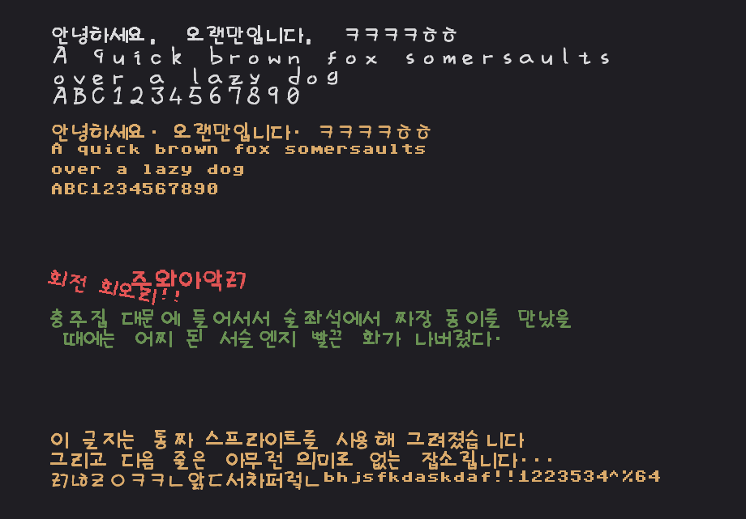
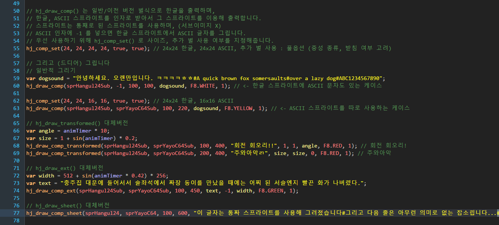

## **함수 길잡이 : 기타**
---

| 함수 이름 | 파라미터 (순서대로) | 비고 |
|-----|-----|-----|
|`hj_string_width(str)`|*문자열*|주어진 문자열의 너비를 반환합니다.|
|`hj_string_width_line(str)`|*문자열*|주어진 문자열의 ***첫 줄***  의 너비를 반환합니다.|
|`hj_string_height(str)`|*문자열*|주어진 문자열의 높이를 반환합니다.|
|`hj_set_align(halign, valign)`|*가로 정렬, 세로 정렬*|정렬을 설정합니다. 기존의 정렬 설정과 동일합니다.|
|`hj_change_font(hanspr, asciispr)`|*한글 스프라이트, ASCII 스프라이트*|문자열을 출력할 떄 쓰이는 스프라이트를 설정합니다.|
|`hj_change_font_ext(hanspr, asciispr, hanwidth, hanheight, asciiwidth, asciiheight)`|*한글 스프라이트, ASCII 스프라이트, 한글 너비, 한글 높이, ASCIII 너비, ASCII 높이*|문자열을 출력할 떄 쓰이는 스프라이트를 설정하고, 글자의 크기도 설정합니다.|

```
hj_string_width(str)
hj_string_height(str)
```

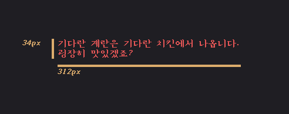
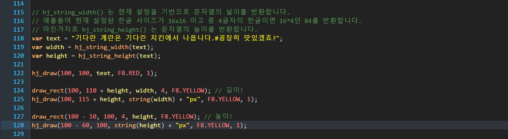

```
hj_set_align(halign, valign)
```

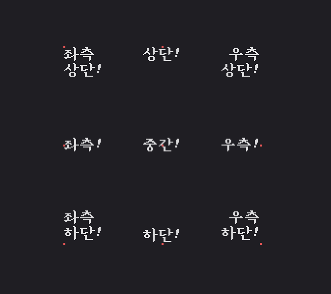
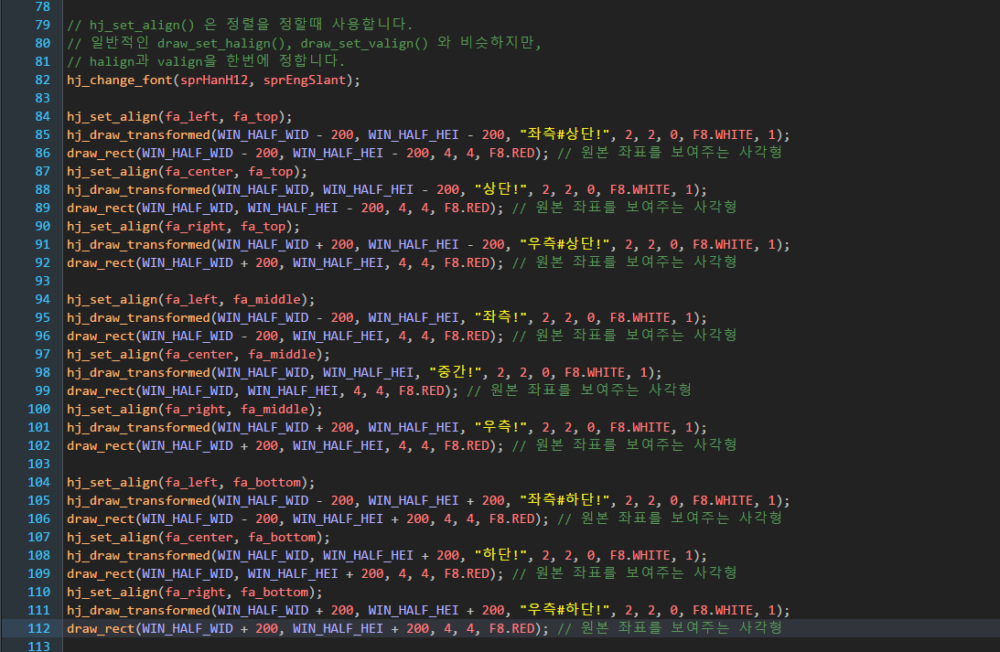

```
hj_change_font(hanspr, asciispr)
hj_change_font_ext(hanspr, asciispr, hanwidth, hanheight, asciiwidth, asciiheight)
```

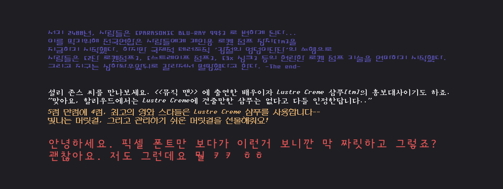
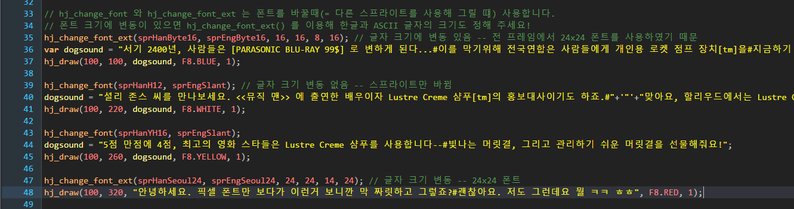

---

글꼴 관련
===

## 글꼴 제작 관련
---

**직접 글꼴를 제작하시려는 분들을 위한 정보입니다.**

## 사제 / 이전 벌식 글꼴
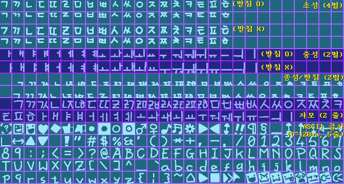

리포지토리 내 `template/JOHAB_TEMPLATE_24` 파일을 참고하시면 됩니다.<br>`.psd`, `.xcf` 형식의 파일이 준비되어있습니다.<br>
템플릿은 24x24 글꼴이며, 중성에 따른 추가 벌 수를 고려하였고 역시 받침(종성) 여부에 따른 추가 벌 수 도 고려하였읍니다.

다음은 초/중/종성의 벌과 관련된 정보입니다.
- 초성 : 총 4벌 (4줄)
    - 1벌 : 받침 있고 중성 `[ㅏ ㅐ ㅑ ㅒ ㅓ ㅔ ㅕ ㅖ ㅣ]` 와 결합 (EX : `먄, 먠, 미`)
    - 2벌 : 받침 있고 중성 `[ㅗ ㅘ ㅙ ㅚ ㅛ ㅜ ㅝ ㅞ ㅟ ㅠ ㅡ ㅢ]` 와 결합 (EX : `옹, 왱, 융`)
    - 3벌 : 받침 없고 중성 `[ㅏ ㅐ ㅑ ㅒ ㅓ ㅔ ㅕ ㅖ ㅣ]` 와 결합 (EX : `개, 네, 아`)
    - 4벌 : 받침 없고 중성 `[ㅗ ㅘ ㅙ ㅚ ㅛ ㅜ ㅝ ㅞ ㅟ ㅠ ㅡ ㅢ]` 와 결합 (EX : `오, 뇌, 위`)
- 중성 : 총 2벌 (2줄)
    - 1벌 : 받침 있는 글자의 중성부분 (EX : `감, 괨, 굼`)
    - 2벌 : 받침 없는 글자의 중성부분 (EX : `오, 우, 야`)
- 종성(받침) : 총 2벌 (2줄)
    - 1벌 : 중성 `[ㅏ ㅐ ㅑ ㅒ ㅓ ㅔ ㅕ ㅖ ㅣ]` 와 결합 (EX : `펭, 귄, 웱`)
    - 2벌 : 중성 `[ㅗ ㅘ ㅙ ㅚ ㅛ ㅜ ㅝ ㅞ ㅟ ㅠ ㅡ ㅢ]` 와 결합 (EX : `뫔, 뭄, 밈`)

## 도깨비한글 8x4x4벌식 글꼴
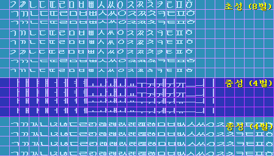
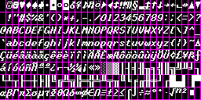

리포지토리 내 `template/DKB844_TEMPLATE_16` 와 `template/DKB844_TEMPLATE_ASCII` 파일을 참고하시면 됩니다.<br>`.psd`, `.xcf` 형식의 파일이 준비되어있읍니다.<br>
템플릿은 16x16 (한글) & 8x16 (ASCII) 글꼴입니다.

다음은 초/중/종성의 벌과 관련된 정보입니다.
- 초성 : 총 8벌 (8줄)
    - 1벌 : 받침없는 `[ㅏ ㅐ ㅑ ㅒ ㅓ ㅔ ㅕ ㅖ ㅣ]` 와 결합
    - 2벌 : 받침없는 `[ㅗ ㅛ ㅡ]`
    - 3벌 : 받침없는 `[ㅜ ㅠ]`
    - 4벌 : 받침없는 `[ㅘ ㅙ ㅚ ㅢ]`
    - 5벌 : 받침없는 `[ㅝ ㅞ ㅟ]`
    - 6벌 : 받침 ***있는*** `[ㅏ ㅐ ㅑ ㅒ ㅓ ㅔ ㅕ ㅖ ㅣ]` 와 결합
    - 7벌 : 받침있는 `[ㅗ ㅛ ㅜ ㅠ ㅡ]`
    - 8벌 : 받침있는 `[ㅘ ㅙ ㅚ ㅢ ㅝ ㅞ ㅟ]`
- 중성 : 총 4벌 (4줄)
    - 1벌 : 받침없는 `[ㄱ ㅋ]` 와 결합 (EX : `괴, 가, 큐, 캬`)
    - 2벌 : 받침없는 `[ㄱ ㅋ]` 이외의 자음과 결합 (EX : `외, 나, 류, 먀`)
    - 2벌 : 받침 ***있는*** `[ㄱ ㅋ]` 와 결합 (EX : `광, 쾅, 굉, 괽`)
    - 3벌 : 받침있는 `[ㄱ ㅋ]` 이외의 자음과 결합 (EX : `웅, 얅, 약, 약`)
- 종성 : 총 4벌 (4줄)
    - 1벌 : 중성 `[ㅏ ㅑ ㅘ]` 와 결합
    - 2벌 : 중성 `[ㅓ ㅕ ㅚ ㅝ ㅟ ㅢ ㅣ]`
    - 3벌 : 중성 `[ㅐ ㅒ ㅔ ㅖ ㅙ ㅞ]`
    - 4벌 : 중성 `[ㅗ ㅛ ㅜ ㅠ ㅡ]`

## 글꼴 편집기
---
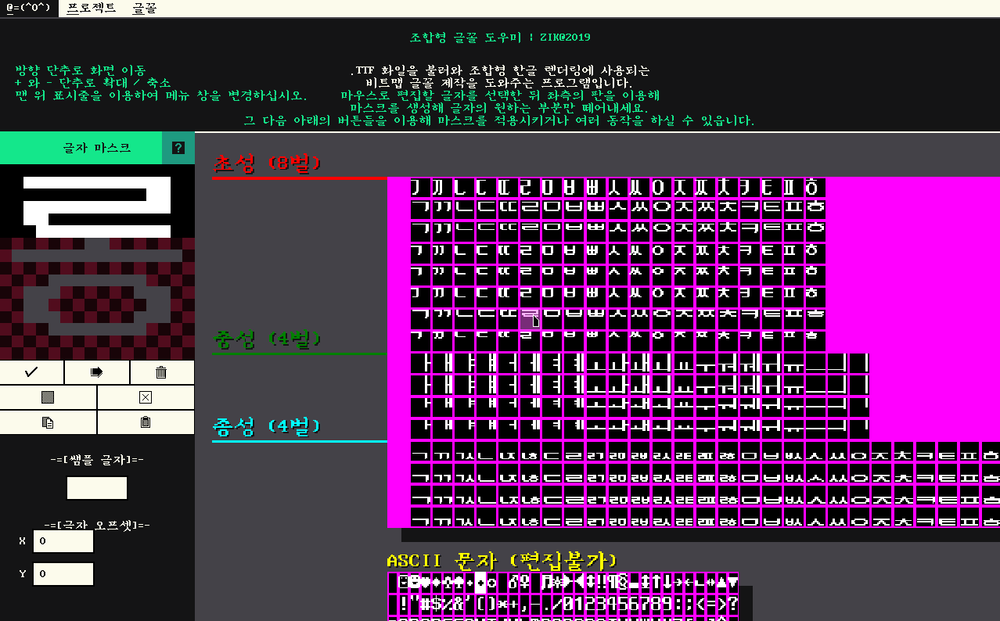
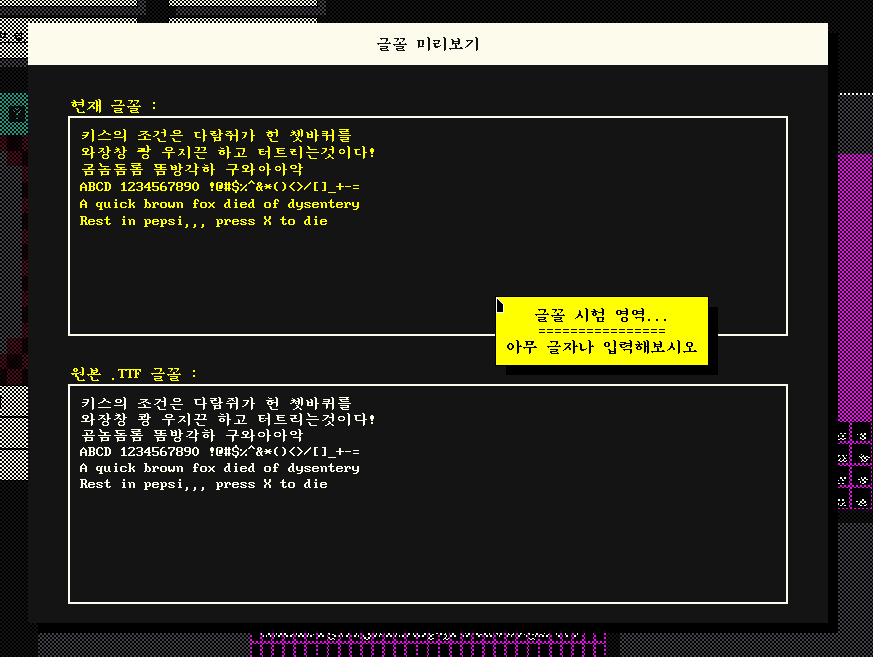

개발 당시 테스트와 글꼴 제작을 돕기 위해 편집기를 뚝딱 만들었습니다.
글자에서 원하는 자모 부분을 떼어내서 비트맵 폰트를 제작하는 방식으로 작동하고,
.PNG로 내보내거나 `uint8_t`로 인코딩 된 헤더 파일로 내보내는 기능을 지원합니다.

itch\.io 에 올려두었으니 필요하시면 확인해 보세요!<br>
(귀찮으시면 `조합_글꼴_편집기.exe`를 실행시켜도 되요. 하지만 늘 최신버전일지는 장담 못해요!)

### **[itch.io 링크](https://zikbakguru.itch.io/einstein-bacon-machine)**


**참고 문헌 & 더 보기**
===

### [김성익님의 한글 출력에 관한 글](https://mytears.org/resources/doc/Hangul/HANGUL.TXT)

### [박연오님의 "한글 비트맵 폰트 출력"](https://bakyeono.net/post/2013-12-03-clojure-hangul-bitmap-font.html)

### [네이버의 "한글 인코딩의 이해"](https://d2.naver.com/helloworld/76650)

### ["한글 구현 및 글꼴(폰트) 처리 관련 C소스코드 자료 모음집"](http://blog.tcltk.co.kr/?p=2858)
